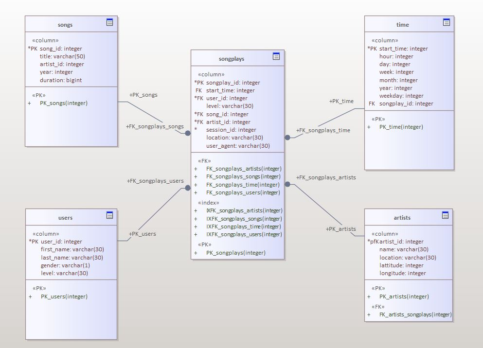

#Project: Data Warehouse

## Project description

In this project, we will build a data warehouses using a AWS redshift cluster.
To build the data warehouse we will use an ETL pipeline for a database hosted on Redshift. The data is loaded from S3 to staging tables on Redshift and execute SQL statements that create the analytics tables from these staging tables.

###S3 data sets

We'll be working with two datasets that reside in S3. Here are the S3 example links for each dataset:

    Song data: s3://udacity-dend/song_data
    Song example: http://s3-us-west-2.amazonaws.com/udacity-dend/song-data/A/A/A/TRAAACN128F9355673.json
    
    Log data: s3://udacity-dend/log_data
    Log example: http://s3-us-west-2.amazonaws.com/udacity-dend/log_data/2018/11/2018-11-30-events.json
    
###Table structure
Fact table:

    songplays - records in event data associated with song plays i.e. records with page NextSong
    songplay_id, start_time, user_id, level, song_id, artist_id, session_id, location, user_agent

Dimension tables:

    users - users in the app
    columns: user_id, first_name, last_name, gender, level
    
    songs - songs in music database
    columns: song_id, title, artist_id, year, duration
    
    artists - artists in music database
    columns: artist_id, name, location, lattitude, longitude
    
    time - timestamps of records in songplays broken down into specific units
    columns: start_time, hour, day, week, month, year, weekday

Database schema:

